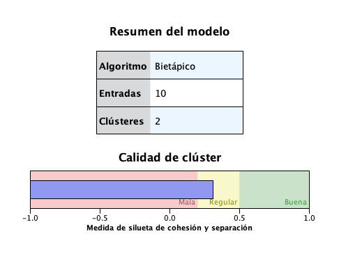

```{r setup, include=FALSE}
knitr::opts_chunk$set(echo = FALSE, out.width = "100%")
library(knitr)
library(cluster)
```


# Introducción

Los anticuerpos son unas proteínas en forma de Y producidas por el sistema inmunológico para identificar y neutralizar las sustancias dañinas y extrañas al cuerpo, llamadas antígenos. La mayor parte de las cadenas ligeras del organismo se encuentran asociadas con cadenas pesadas para dar lugar a los anticuerpos. El anticuerpo más frecuente está formado por unidades básicas estructurales que disponen de cuatro cadenas: dos ligeras y otras dos pesadas. Los anticuerpos, son utilizados por el sistema inmunitario para reconocer y bloquear virus, bacterias, parásitos u hongos. Pueden hallarse en la sangre o en otros fluidos del cuerpo y se piensa que el hecho de presentar anticuerpos a un determinado virus puede estar relacionada con el siguiente conjunto de variables: edad, sexo, factor RH, número de componentes que constituyen las cadenas pesadas y ligeras, vacunación, toma habitual de medicamentos, tipo de dieta y, finalmente, consumo de tabaco.

# Two Step Clúster

Mediante el método Bi-etápico de IBM se obtienen los conglomerados de los datos de 100 pacientes.

En el gráfico 1 resumen se presenta sobre la calidad señala una débil estructura de conglomerados.

El gráfico 2 muestra que existen dos clústeres distribuidos con 57% y 43% respectivamente. 

El gráfico 3 muestra que el predictor más importante para la clasificación de los clústeres comienza con el anticuerpo, seguido del número de componentes que constituyen las cadenas ligeras. El tipo de dieta fue el predictor que menos aporta la formación de los clongomerados. 

En particular, el gráfico 4 señala para el clúster 1 se compone en su mayoría por la identificación positiva de los anticuerpos, con un 83% de importancia, mientras que para el clúster 2 lo es la identificación negativa con un 100% de importancia del predictor. 

Finalmente, los gráficos 5 y 6 muestran las funciones de distribución absoluta y relativa de cada variable respecto a su conglomerado.

# ClusPlot

En contraparte, con el paquete `cluster` de R, mediante la clasificación de matrices por disimilitud junto con la partición alrededor de mediodes y tomando como referencia los clústeres del método bi-etápico, se obtiene el gráfico 7. Además, el cuadro 1 señala que el primer cluster está conformado por el 68% de las observaciones, mientras que el segundo por el 32%.

# Clúster bi-etápico vs ClusPlot

Comparando la información que brinda cada método, claramente el método bi-etápico es mucho más descriptivo y profundo en el análisis de la clasificación. En contraste, el método ClusPlot no brinda información intuitiva desagregada como sucede con la clasificación Two Steps.

```{r, fig.cap="Resumen del modelo"}

```


```{r, fig.cap="Tamaño de los clúster"}

```


```{r, fig.cap="Importancia del predictor"}

```


```{r, fig.cap="Importancia del predictor por clúster"}

```

```{r, fig.cap="Distribución absoluta"}

```

```{r, fig.cap="Distribución relativa"}

```


```{r, fig.cap="Clústeres por partición alrededor de mediodes", fig.height=7, warning=FALSE, message=FALSE, comment=FALSE}
datos = foreign::read.spss("anticuerpos.sav", to.data.frame = T)
dat = datos[, 2:ncol(datos)]

datos.dis = daisy(dat, stand = T, metric = "gower")
clus = pam(datos.dis, 2, diss = T)
clusplot(clus, color = T, labels = 2, col.p = "green", main = "")
```


```{r}
kable(round(clus$clusinfo, 3), format = "pandoc" ,caption = "Tamaño de los clústeres", booktabs = T)
```

