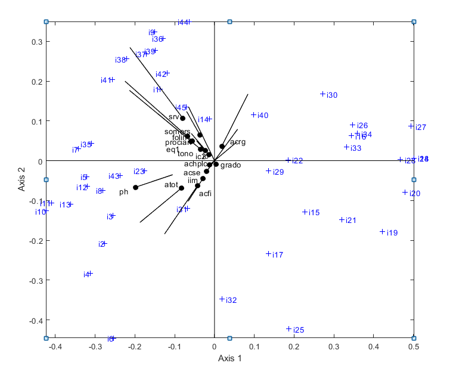

```{r setup, include=FALSE}
knitr::opts_chunk$set(
	echo = FALSE,
	message = FALSE,
	warning = FALSE,
	comment = NA
)
library(skimr)
library(MultBiplotR)
load("Datos15.rda")
Vinos = Datos
names(Vinos)[1] = "año"
load("Binarios15.rda")
```

\bigskip

\bigskip

# Introducción

La gente considera que tomar vino es uno de los placeres de la vida, cuya evidencia es mostrada por @ferranini2010. Con la apertura comercial internacional no es sorpresa que el consumo de vino en el mundo vaya en aumento debido a la creciente demanda en países asiáticos, Europa del Norte y América del Norte [@mariani2012]. 

A pesar de ello, el consumo interno del vino decrece desde los 90 en los países mediterráneos, en contraste con el alza de la demanda internacional de sus productos originarios [@pyorala1990; @mtimet2006]. En particular, la demanda por vinos de Denominación de Origen (en adelante, DO) presenta patrones de preferencia que se pueden atribuir a la etnografía y la calidad [@BERNABEU201377]. Para el caso ibérico, @mtimet2006 señalan que no solamente la demanda por vinos de DO nacionales va incrementando gradualmente, sino que el patrón de consumo final está determinado por la DO y la edad del vino, debido a que el consumidor los considera como una aproximación suficiente para probar la calidad.

No obstante, la determinación y clasificación de la calidad generalmente es más robusta cuando se realizan análisis de la composición bioquímica de los vinos. Los resultados de estos análisis pueden incluso ser utilizados como herramientas para detectar adulteraciones. Un ejemplo de ello es mezclar vinos de baja calidad con aquellos de alta calidad con el fin de obtener mejores ganancias [@ogrinc_application_2003].

Una de las vías más precisas es utilizar métodos estadísticos de análisis multivariante y reducción de dimensiones de componentes químicos para poder identificar correctamente el tipo de vino a exponer. Existen diversos estudios donde se utilizaron métodos supervisados y no supervisados para clasificar diversas variedades de vino pertenecientes a distintas regiones de España. [@tapias1986; @santa1986; @callao1987; @vasconcelos1989]

El presente trabajo se concentra en explorar las características de tres técnicas biplot que permiten extraer información pertinente para este tipo de análisis. En particular, se explora el análisis de @rivasgonzalo_etal_1993, en el cual se analizan 45 vinos tintos crianza de 1986 y 1987 con DO Ribera del Duero y Toro. Los autores utilizaron como herramienta de análisis el HJ-Biplot, desarrollado por [@villardon1986]; el Biplot Logístico Externo, propuesto por @vicente2006; finalmente se utiliza análisis canónico para detectar relaciones entre grupos [@amaro2004].

Se encuentra que la denominación de origen está correctamente identificada, pero se detecta que la variación de las variables no es suficiente para diferenciar y clasificar correctamente a los vinos Toro de diferentes años. 

# Metodología

## Datos

@rivasgonzalo_etal_1993 recolectaron una muestra de 45 vinos en 21 variables, los cuyos detalles se muestran en el cuadro 1. Estos vinos se obtuvieron directamente de las bodegas pertenecientes a los concejos reguladores de las DO tanto de Ribera del Duero como Toro para garantizar la adecuación y representatividad de la muestra.

```{r}
tabla_skim = skimr::skim_without_charts(Vinos)
tabla_skim$complete_rate = NULL
tabla_skim$n_missing = NULL
tabla_skim$factor.ordered = NULL
tabla_skim
```

\addtocounter{table}{-2}

## Métodos

Para el análisis de los datos se exploran tres técnicas del Biplot. En principio, el desarrollo formal del gráfico Biplot fue desarrollada por [@gabriel1971]. Su propósito es mostrar gráficamente una matriz de datos multivariantes $\mathbf{X}$ con $\mathrm{n}$ filas o individuos y $\mathrm{j}$ columnas o variables para representarlos en alta calidad de representación (i.e. $\cos^2$ del ángulo del vector de las variables, con la correlación al cuadrado del eje que se encuentra entre la variable y el eje). Tiene de fondo el principio de reducción de dimensiones mediante la descomposición en valores singulares. Se expresa como 

\begin{equation}
\mathbf{X} = \mathbf{UDV}^{\mathrm{T}}
\end{equation}

donde $\mathbf{U}$ es una matriz con vectores columna son ortonormales y vectores propios de $\mathbf{XX'}$; $\mathbf{V}$ es una matriz ortonormal cuyos vectores columna son vectores propios de $\mathbf{X'X}$; $\mathbf{D}$ es la matriz diagonal de valores singulares de $\mathbf{X}$, que son las raíces cuadradas no negativas de los valores propios de $\mathbf{X'X}$.

@gabriel1971 propuso dos gráficos, JK-Biplot y GH-Biplot (o CMP y RMP según @greenacre1984), los cuales representan $\mathrm{I}$ y $\mathrm{J}$, respectivamente. La limitante de estas propuestas descansa en la incapacidad de mostrarlos simultáneamente. Teniendo esto en consideración [@villardon1986] desarrolló el modelo HJ-Biplot, el cual permite representar con la máxima calidad tanto las filas como las columnas. En consecuencia, el modelo está ligado al análisis de componentes principales. La matriz $\mathbf{X}$ se aproxima a 

\begin{equation}
\mathbf{X} = \mathbf{AB'} + \mathbf{E}
\end{equation}

la cual, al descomponer en valores singulares, se expresa como 

\begin{equation}
\mathbf{X} = \mathbf{UDV}^{\mathrm{T}} \\
\mathbf{J} = \mathbf{UD} \qquad \mathbf{H} = \mathbf{DV}
\end{equation}

Por otra parte, para datos binarios se utiliza un el biplot logístico, propuesto por @vicente2006, en donde se tiene una matriz binaria $\mathbf{X}_{n \times p}$ cuyas filas pertenecen a $n$ individuos y $p$ variables binarias. Luego entonces, sea $p_{ij} = E(x_{ij})$ la probabilidad esperada que la variable $j$ represente al individuo $i$, el modelo bilinear logístico se expresa 

\begin{equation}
p_{ij} = \frac{e^{b_{j0} + \sum_k b_{jk}a_{ik}}}{1 + e^{b_{j0} + \sum_k b_{jk}a_{ik}}}
\end{equation}

donde $a_{ik}$ y $b_jk$ ($i = 1, ...,n; \; j=1, ..., p; \; k=1, ..., r$) son los parámetros del modelo utilizados en los marcadores de las filas y columnas, respectivamente.

Por lo tanto, el modelo tiene al logit como el vínculo de la función.

\begin{equation}
logit(p_{ij}) = b_{j0}+ \sum_{k=1}^{q}b_{jk}a_{ik} = b_{jk}+\mathbf{a'}_i\mathbf{b}_j
\end{equation}

Cuya representación matricial se expresa como

\begin{equation}
logit(\mathbf{P}) = \mathbf{1}_n \mathbf{b'}_0 + \mathbf{AB'}
\end{equation}

Donde $\mathbf{P}$ es la matriz esperada de probabilidades, $\mathbf{1}_n$ el vector de unos, $\mathbf{b}_0$ el vector que contiene las constantes, $\mathbf{A}$ y $\mathbf{B}$ las matrices que contienen a los marcadores de los individuos y las columnas de $\mathbf{X}$.

Finalmente, aprovechando de nuevo los datos no binarios, se utiliza el análisis canónico o coordenadas discriminantes para conocer máxima separación entre los grupos y las variables [@amaro2004], los cuales están asociados al MANOVA. Tomando en cuenta que los datos cuentan grupos y variables, la modalidad de *Biplot-total* permite una representación simultánea entre ellos. En este caso, el modelo MANOVA se expresa como

\begin{equation}
\mathbf{X} = \mathbf{AB} + \mathbf{U}
\end{equation}

donde $\mathbf{X}$ es la matriz $\mathrm{n · p}$ de las observaciones; la matriz de diseño $\mathbf{A}$ corresponde al rango r; $\mathbf{B}$ es la matriz de los parámetros desconocidos, y; finalmente, en $\mathbf{U}_{n · p}$ están representados los residuales. Al construir la matriz a partir de la descomposición en valores singulares generalizada, se obtiene que el biplot se define como $\mathbf{R} = (\mathbf{A'}\mathbf{A})^{-1}$, $\mathbf{\hat{D}} = (\mathbf{A'}\mathbf{A})^{-1}\mathbf{A}\mathbf{X}$ y $\mathbf{C} = \mathbf{I}$ [@amaro2004].

# Resultados

Para realizar los cálculos estadísticos se utilizó el software MultBiplot [@vicente2014Multbiplot], mediante el lenguaje de programación @r2019 y MATLAB, el cual contiene los métodos anteriormente explicados.

## HJ Biplot

Para poder proyectar el HJ-Biplot es necesario realizar un análisis de componentes principales para conocer los valores propios de la matriz $\mathbf{X}$, así como la inercia contenida. En el cuadro \ref{tab:inercia} se muestra que con tres dimensiones se explica el 65.9% de la variabilidad total.

```{r}
vinnum = Vinos[, 4:21]

acpvino = PCA.Analysis(vinnum)
inercia = data.frame(Eigen = acpvino$EigenValues[1:3],
Inercia = acpvino$Inertia[1:3],
Inercia_acum = acpvino$CumInertia[1:3])

knitr::kable(inercia, format = "pandoc", col.names = c("Valores propios", "Inercia", "Inercia acumulada"), caption = "Valores propios y varianza explicada (Inercia) \\label{tab:inercia}")
```

```{r hjbiplot, fig.cap="HJ Biplot"}
HJ_biplot = HJ.Biplot(vinnum)

HJ_clust = AddCluster2Biplot(
  HJ_biplot,
  NGroups = 4,
  ClusterType = "hi",
  method = "ward.D",
  Original = TRUE
)
plot(HJ_clust, PlotClus = TRUE, margin = 0.2)
```

Conociendo la inercia, en la figura 1 se muestra el plano de máxima inercia, en donde adicionalmente se señalan los clústeres de representación. De él destaca que el cluster que contiene las observaciones v15, v16, v17, v18, v19, v20, v21, v22, v24, v25, v26, v27 y v28 corresponden a la DO Ribera del Duero del año 87, donde el ph contribuye en mayor medida a la variabilidad de estas variables. Los demás clústeres condensan a diferentes DO y diferentes años. Aunque se puede describir más, en general se puede interpretar que existe heterogeneidad en la contribución de las variables en dos clústeres y una ambigüedad en otros dos.

## Biplot logístico

```{r logbiplot, fig.cap="Biplot logístico", out.width="75%", fig.align="center"}

```

En el caso del biplot logístico mostrado en la figura 2, también se puede deducir que la distribución de los individuos es diferente, pero la contribución de las variables es diferente. Por ejemplo, el ph contribuye a variables distintas. A pesar de ello, las direcciones de los vectores de las variables como el somers, folin, y alrededor siguen el mismo patrón.

## Análisis Canónico

```{r disald, fig.cap="Función discriminante", fig.align="center"}
ald = MASS::lda(vinnum, Vinos$denomina)
plot(ald, dimen=1, type="both", col = "steelblue")
```

Mediante un análisis discriminante lineal, se obtiene la clasificación de grupos tomando como referencia a cada una de las DDOO. La figura 3  muestra cómo el modelo logra clasificar correctamente a los dos grupos.

```{r canonico, fig.cap="Biplot canónico discriminante"}
canonico = Canonical.Variate.Analysis(vinnum, group = Vinos$grupo)
plot(canonico)
```

Prosiguiendo con el análisis MANOVA y su consecuencia proyección en el biplot-total, la figura 4 muestra una clasificación similar a lo detectado por el HJ-Biplot en el sentido en que los vinos Ribera del Duero del 87 están claramente diferenciados del resto. Además de que los vinos del Toro entre años tienen una variabilidad cercana, cuyo patrón se puede rescatar de los otros dos métodos de biplot.

# Discusión

Con los resultados de los análisis podemos deducir que aunque es posible diferenciar las denominaciones de origen, los vinos Toro presentan problemas de representación. En suma, cada método no es mejor que el otro, sino herramientas útiles cuyo aprovechamiento depende del objetivo de la investigación o respuesta que se quiera responder en cuanto al documento. Queda en manifiesto que las técnicas biplot son una representación gráfica poderosa que permite extraer información relevante con precisión.

# Referencias