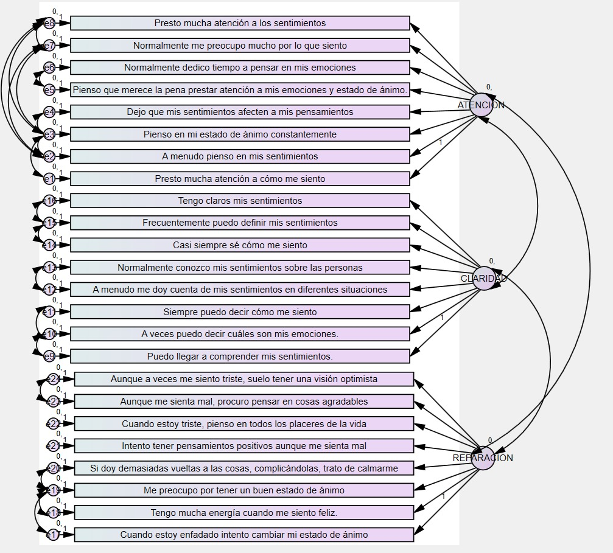

```{r setup, include = FALSE}
knitr::opts_chunk$set(echo = FALSE, warning = FALSE, message = FALSE, comment = NA)

library(haven)
library(mirt)
library(psych)
library(ltm)
library(magrittr)
library(knitr)
library(kableExtra)

Datos <- read_sav("data/TMMS_corregida2.sav")
```

# Introducción

**CUIDADO** *Toda la introducción son las instrucciones del examen. Habrá que darle un cambio o rehacer la introducción*

Tradicionalmente, se evaluaba a los estudiantes a través de test de CI para predecir su rendimiento académico y se consideraba que el CI era el factor que mejor explicaba el rendimiento intelectual. Sin embargo, actualmente, sabemos que nuestro equilibrio emocional y nuestra salud no están relacionados con nuestro CI, sino que existen otras habilidades emocionales y sociales que permiten nuestro ajuste social y relacional (Gardner, 2001) y que tiene una incidencia clarísima sobre el éxito académico, profesional y personal.

Según los autores Peter Salovey y John Mayers (1990), la inteligencia emocional es la habilidad de las personas para atender y percibir los sentimientos de forma apropiada y precisa, la capacidad para asimilarlos y comprenderlos de forma adecuada y la destreza para regular y modificar nuestro estado de ánimo.

Rafael Bisquerra (2003) ha aplicado la inteligencia emocional a la educación, acuñando el término Educación Emocional para hacer referencia a un proceso educativo, continuo y permanente, que pretende potenciar el desarrollo emocional como complemento indispensable del desarrollo cognitivo, constituyendo ambos los elementos esenciales del desarrollo de la personalidad integra. Bisquerra considera que la educación consiste en formar personas y no solo en impartir conocimientos. Además, refiere que la educación debe ser para la vida y por ello debe responder al desarrollo integral de los alumnos: social, moral y emocional. Del mismo modo, considera que los profesores también deben ser “emocionales”; es decir, que completen la enseñanza de competencias cognitivas con competencias emocionales y sociales y que sepan gestionar las emociones de la clase. Incluir la educación emocional y social en el aula tiene múltiples beneficios para el alumno tales como orientar el proceso de información, formar de manera integral para la vida y favorecer las conductas sociales.

Bisquerra (2012) refiere que poseer inteligencia emocional significa poner en práctica un conjunto de competencias emocionales que son los conocimientos, capacidades, habilidades y actitudes necesarios para comprender, expresar y regular de forma apropiada las emociones:

*	Conciencia emocional: capacidad de tomar conciencia de las propias emociones y de los demás.
*	Regulación emocional: Capacidad para manejar las emociones de forma apropiada.
*	Autonomía emocional: capacidad para autogenerarse las emociones apropiadas en un momento determinado. Esto incluye una buena autoestima, actitud positiva hacia la vida y responsabilidad.

(Estas tres competencias formarían parte de la inteligencia intrapersonal según la define Gardner)

*	Habilidades socio-emocionales: capacidad para mantener unas buenas relaciones con los demás.
*	Habilidades para la vida y el bienestar emocional: comportamientos apropiados y responsables para afrontar los retos que se nos plantean y que nos permite organizar nuestra vida de forma sana y equilibrada, siendo capaces de generarse emociones positivas y relacionarse satisfactoriamente con los demás.

(Estas dos competencias formarían parte de la inteligencia interpersonal según la define Gardner)

# Métodos

## Cuestionario

La Inteligencia Emocional puede evaluarse con el instrumento TMMS.

El TMMS-24 está basada en el Trait-Meta Mood Scale (TMMS) del grupo de investigación Salovey y Mayer. La escala original es una escala que evalúa el metaconocimiento de los estados emocionales mediante 48 ítems. Fdez-Berrocal y col, propusieron una versión modificada del TMMS en español, como resultado de previas investigaciones y propusieron una versión simplificada, la TMMS de 24 ítems. Los ítems se miden en escala Likert puntuados del 1 al 5, donde 1 es totalmente en desacuerdo y 5 representa estar totalmente de acuerdo con la proposición. 

La TMMS contempla tres dimensiones de la Inteligencia Emocional:

* Atención: soy capaz de sentir y expresar los sentimientos de forma adecuada.
* Claridad: comprendo bien mis estados emocionales.
* Reparación: soy capaz de regular los estados emocionales correctamente.

El cuestionario es el siguiente:

```{r, eval=TRUE}
cuest_tmms = data.frame(
  No. = c(1:24),
  Pregunta = c(
    "Presto mucha atención a los sentimientos.",
    "Normalmente me preocupo mucho por lo que siento.",
    "Normalmente dedico tiempo a pensar en mis emociones.",
    "Pienso que merece la pena prestar atención a mis emociones y estado de ánimo.",
    "Dejo que mis sentimientos afecten a mis pensamientos.",
    "Pienso en mi estado de ánimo constantemente.",
    "A menudo pienso en mis sentimientos.",
    "Presto mucha atención a cómo me siento.",
    "Tengo claros mis sentimientos.",
    "Frecuentemente puedo definir mis sentimientos.",
    "Casi siempre sé cómo me siento.",
    "Normalmente conozco mis sentimientos sobre las personas.",
    "A menudo me doy cuenta de mis sentimientos en diferentes situaciones.",
    "Siempre puedo decir cómo me siento.",
    "A veces puedo decir cuáles son mis emociones.",
    "Puedo llegar a comprender mis sentimientos.",
    "Aunque a veces me siento triste, suelo tener una visión optimista.",
    "Aunque me sienta mal, procuro pensar en cosas agradables.",
    "Cuando estoy triste, pienso en todos los placeres de la vida.",
    "Intento tener pensamientos positivos aunque me sienta mal.",
    "Si doy demasiadas vueltas a las cosas, complicándolas, trato de calmarme.",
    "Me preocupo por tener un buen estado de ánimo.",
    "Tengo mucha energía cuando me siento feliz.",
    "Cuando estoy enfadado intento cambiar mi estado de ánimo."
  ),
  n = c(rep(1, times = 24)),
  a = c(rep(2, times = 24)),
  b = c(rep(3, times = 24)),
  m = c(rep(4, times = 24)),
  t = c(rep(5, times = 24))
)

t1 = data.frame("TMMS-24" =  "INSTRUCCIONES: A continuación encontrará algunas afirmaciones sobre sus emociones y sentimientos. Lea atentamente cada frase e indique, por favor, el grado de acuerdo o desacuerdo con respecto a las mismas. **Señale con una “X” la respuesta que más se aproxime a sus preferencias.** \nNo hay respuestas correctas o incorrectas, ni buenas o malas. No emplee mucho tiempo en cada respuesta.")

t2 = data.frame("**1**: Nada de acuerdo", "**2**: Algo de acuerdo", "**3**: Bastante de acuerdo", "**4**: Muy de acuerdo", "**5**: Totalmente de acuerdo.")
t3 = cuest_tmms

k1 = kable(t1, format = "markdown", col.names = "**TMMS-24**")
k2 = kable(t2, format = "markdown", col.names = c(rep("", times = 5)))
k3 = kable(t3, format = "latex", booktabs = F, col.names = c("No.", "Pregunta", "", "", "", "", "")) %>% 
  kable_styling(position = "center") %>% 
  column_spec(1, border_left = T) %>%
  column_spec(7, border_right = T)

k1
k2 
k3

```


\addtocounter{table}{-2}

Para corregir y obtener una puntuación en cada uno de los factores, se suman los ítems del 1 al 8 para el factor Atención Emocional, los ítems del 9 al 16 para el factor Claridad Emocional y del 17 al 24 para el factor Reparación de las emociones. Luego se compara la puntuación en las tablas que muestran los puntos de corte para hombres y mujeres, pues existen diferencias en las puntuaciones para cada uno de ellos.

## Teoría de respuesta al ítem

La información es el inverso de variabilidad. Es decir, a mayor información, menor variabilidad.

## Modelo de Samejima


# Resultados

## Descripción

```{r, eval=TRUE}
library(data.table)
library(scales)

previa = foreign::read.spss("data/TMMS_corregida3.sav", to.data.frame = T)

n_prof = as.data.table(table(droplevels(previa$Profesion)))
n_prof[, PROP := N/sum(N)]
n_prof[, V1 := c("curas", "farmacéuticos", "profesores del estado mexicano de Colima", "alumnos universitarios de Portugal", "personas que ni estudian ni trabajan")]
setorder(n_prof, -N)
t_prof = n_prof[, .(V2 = paste0(N = comma(N), " ", V1," (", PROP = percent(PROP), ")"))]

n_sexo = as.data.table(table(droplevels(previa$SEXO)))
n_sexo[, PROP := N/sum(N)]
n_sexo[, V1 := ifelse(V1 == "Hombre", paste0(V1, "s"), paste0(V1, "es"))]
setorder(n_sexo, -N)
t_sexo = n_sexo[, .(V2 = paste0(N = comma(N), " ", tolower(V1)," (", PROP = percent(PROP), ")"))]

n_edad = as.data.table(table(droplevels(previa$EDAD)))
n_edad[, V1 := c("menores de 30", "entre 30 y 40", "de 41 a 50", "mayores a 50")]
n_edad[, PROP := N/sum(N)]
setorder(n_edad, -N)
t_edad = n_edad[, .(V2 = paste0(N = comma(N), " ", V1," (", PROP = percent(PROP), ")"))]

library(likert)
tmms = as.data.table(Datos[, 4:27])
tmmsf = tmms[, lapply(.SD, function(x) factor(x, levels = c("1", "2", "3" , "4", "5"), ordered = T))]
tmmsl = likert(tmmsf)

tab_tmms = as.data.table(tmmsl$results)
tab_tmms[, 2:6] = tab_tmms[, lapply(.SD, round, 1), .SDcols = c(as.character(1:5))]
tab_tmms[, Item := 1:24]
tab_tmms = cbind(Dimensiones = c("Atención", rep("", times = 7), "Claridad", rep("", times = 7), "Reparación", rep("", times = 7)), tab_tmms)

k_tmms = kable(tab_tmms, format = "pandoc", booktabs = T, linesep = c(rep('', times = 7), '\\addlinespace'), caption = "Frecuencias relativas de los reactivos del TMMS-24 por dimensiones\\label{tab:tab_tmms}") %>% 
  kable_styling(position = "center")
```

Derivado del levantamiento del cuestionario, se recopilaron originalmente 3595 observaciones. Además de los 24 reactivos, se disponen de tres variables categóricas para identificar a grupos de respondientes: profesión, sexo y rango de edad. No obstante, dado que algunas observaciones de los reactivos presentaron inconsistencias y valores perdimos, se decidió no contar con ellos dado que una imputación podría crear inconsistencias metodológicas. Por lo tanto, quedaron 3153 observaciones. Cabe señalar que solamente se retiraron las filas incompletas de los reactivos, por lo que en las variables categóricas existen valores faltantes.

Por parte de los profesionales, el grupo mayoritario fueron `r t_prof[1, V2]`, seguidos de `r toString(t_prof[2:4, V2])` y, finalmente, `r t_prof[5, V2]`.

El sexo de los respondientes se comprende de `r t_sexo[1, V2]` y `r t_sexo[2, V2]`, con 12 valores faltantes.

Por último, los rangos de edad se distribuyen de la siguiente manera: el grupo mayoritario son `r t_edad[1, V2]`; le siguen `r t_edad[2, V2]`, `r t_edad[3, V2]` y `r t_edad[4, V2]`, así como 2 valores faltantes.

En cuanto a los reactivos, el cuadro \ref{tab:tab_tmms} muestra las frecuencias relativas de las puntuaciones de cada ítem, por dimensión:

```{r, eval=TRUE}
k_tmms
```


```{r, eval=TRUE}
TMMS <- Datos[,4:27]

# Eliminar valores en 0 || NA
TMMS <- TMMS[!(apply(TMMS, 1, function(y) any(y == 0 | y == 6 | is.na(y)))),]

# Convertir en numeros
TMMS <- mapply(TMMS, FUN = as.numeric)

colnames(TMMS) <- c(paste0("A", 1:8), paste0("C", 9:16), paste0("R", 17:24))

ATENCION <- TMMS[,1:8]
CLARIDAD <- TMMS[,9:16]
REPARACION <- TMMS[,17:24]
```

# Análisis de las características psicométricas del cuestionario TMMS

## Análisis factorial exploratorio

```{r corr, fig.cap="Correlaciones entre ítems"}
# Correlaciones
library(ggcorrplot)
ggcorrplot(cor(TMMS), colors = c("red3", "white", "steelblue"))
```


```{r}
#Prueba de KMO y Bartlett
esfe = matrix(nrow = 5, ncol = 2)

rownames(esfe) = c(
  "Determinante",
  "Medida Kaiser-Meyer-Olkin de adecuación de muestreo",
  "Prueba de esfericidad de Bartlett",
  "",
  ""
)

esfe[, 1] = c("", "", "Aprox. Chi-cuadrado", "gl", "Sig.")
esfe[, 2] = c("8.973E-7", "0.930",  "43765.192", 276, "0.000")

tab_esfe = kable(esfe,
                 format = "pandoc",
                 align = c("l", "r"),
                 caption = "Pruebas de esfericidad\\label{tab:tab_esfe}")
```

```{r}
tab_esfe
```


```{r}
# Unicidades

## AF Varimax
mat_ai_v_raw = readxl::read_excel("data/afvar4.xlsx", range = "B2:Z26", col_names = T)
mat_ai_v = as.matrix(mat_ai_v_raw[, 2:25])

# AF Oblimin
mat_ai_o_raw = readxl::read_excel("data/afobl4.xlsx", range = "B2:Z26", col_names = T)
mat_ai_o = as.matrix(mat_ai_o_raw[, 2:25])

# Comunalidades
com_acp = readxl::read_excel("data/acp5.xlsx", range = "B2:C26", col_names = T)
com_afv = readxl::read_excel("data/afvar5.xlsx", range = "B2:C26", col_names = T)

# Comunalidades y unicidades
com_uni = data.frame(
  ACP = com_acp[,2],
  AFI = com_afv[,1],
  AFE = com_afv[,2],
  Uni = diag(mat_ai_v)
)
colnames(com_uni) = c("Extracción ACP", "Inicial AF", "Extracción AF", "Unicidades")
rownames(com_uni) = colnames(TMMS)

tab_comuni = kable(round(com_uni, 3), format = "pandoc", caption = "Comunalidades y unicidades\\label{tab:tab_comuni}")
```

```{r}
tab_comuni
```


```{r}
# Varianza explicada

var_exp_raw = readxl::read_excel("data/afvar6.xlsx", range = "B3:J6", col_names = T)

var_exp = data.frame(
  Titulo = c("Autovalores iniciales", "", "",
             "$\\sum a_i^2$ de la extracción", "", "",
             "$\\sum a_i^2$ de la rotación", "", ""),
  Desc = c(rep(c("Total", "% de varianza", "% acumulado"), times = 3)),
  round(t(var_exp_raw), 3)
)

rownames(var_exp) = NULL

tab_varexp = kable(var_exp, format = "pandoc", col.names = c("", "", "Factor 1", "Factor 2", "Factor 3"),
                   caption = "Varianza total explicada\\label{tab:tab_varexp}")
```


```{r}
tab_varexp
```


```{r}
# Matrices

mat_com = readxl::read_excel("data/acp8.xlsx", range = "A3:D27", col_names = T)
mat_vmx = readxl::read_excel("data/afvar8.xlsx", range = "A3:D27", col_names = T)
mat_obl = readxl::read_excel("data/afobl10.xlsx", range = "A3:D27", col_names = T)

mat_fac = cbind(mat_com[2:4], mat_vmx[,2:4], mat_obl[, 2:4])
mat_fac = round(mat_fac, 3)
rownames(mat_fac) = colnames(TMMS)

tab_matfac = kable(mat_fac,
                   format = "latex",
                   caption = "Matrices derivadas de métodos de extracción",
                   booktabs = T,
                   linesep = c(rep("", times = 7), "\\addlinespace")) %>%
  add_header_above(c(
    " " = 1,
    "Componentes" = 3,
    "Factores con Varimax" = 3,
    "Factores con Oblimin" = 3
  ),
  bold = T) %>%
  add_header_above(c(
    " " = 1,
    "Componentes Principales" = 3,
    "Factorización de eje principal" = 6
  )) %>%
  kable_styling(latex_options = "HOLD_position")
```

```{r tab_matfac}
tab_matfac
```


## Análisis factorial confirmatorio

```{r, eval=TRUE, out.width='80%', fig.cap="Modelo confirmatorio del TMMS-24", fig.align="center"}

```

## Capacidad informativa del TMMS

```{r, eval=TRUE, include=FALSE}
PolyTMMS <- polychoric(TMMS)
irtTMMS <- irt.fa(PolyTMMS, plot = FALSE)
PolyATENCION <- polychoric(ATENCION)
irtATENCION <- irt.fa(PolyATENCION, plot = FALSE)
PolyCLARIDAD <- polychoric(CLARIDAD)
irtCLARIDAD <- irt.fa(PolyCLARIDAD, plot = FALSE)
PolyREPARACION <- polychoric(REPARACION)
irtREPARACION <- irt.fa(PolyREPARACION, plot = FALSE)

mirtA <- mirt(ATENCION, model = 1, technical = list(removeEmptyRows=TRUE))
mirtC <- mirt(CLARIDAD, model = 1)
mirtR <- mirt(REPARACION, model = 1)
```


### Del análisis factorial

```{r, eval=TRUE, fig.height=7, fig.cap="Curvas de información del análisis factorial"}
par(mfrow = c(2, 2))
plot(
  irtTMMS,
  type = "test",
  main = "Test",
  xlab = "Caract. latente (escala normal)",
  ylab = "Información del test"
)
plot(irtATENCION,
     main = "Ítems de Atención",
     xlab = "Caract. latente (escala normal)",
     ylab = "Información del ítem")
plot(irtCLARIDAD,
     main = "Ítems de Claridad",
     xlab = "Caract. latente (escala normal)",
     ylab = "Información del ítem")
plot(irtREPARACION,
     main = "Ítems de Reparación",
     xlab = "Caract. latente (escala normal)",
     ylab = "Información del ítem")
```

Observaciones del analisis factorial en las graficas, podemos ver con las curvas  de informacion de los items tienen importancias similares, aunque encontramos items que presentan menos informacion como el A5, A6, C14, C15, R19 y R23.


### De la Teoría de Respuesta del Ítem

```{r, eval=TRUE, fig.height=8, fig.cap="Capacidad informativa del test"}
library(lattice)
pmirtaI = plot(mirtA, type = "info", main = "Test Atención")
pmirtcI = plot(mirtC, type = "info", main = "Test Claridad")
pmirtrI = plot(mirtR, type = "info", main = "Test Recuperación")

print(pmirtaI, split = c(1, 1, 1, 3), more = TRUE)
print(pmirtcI, split = c(1, 2, 1, 3), more = TRUE)
print(pmirtrI, split = c(1, 3, 1, 3))
```

\break

```{r, eval=TRUE, fig.height=8, fig.cap="Curvas características de los ítems por dimensión"}
pmirtaIT = plot(mirtA, type = "infotrace", main = "CC Atención")
pmirtcIT = plot(mirtC, type = "infotrace", main = "CC Claridad")
pmirtrIT = plot(mirtR, type = "infotrace", main = "CC Recuperación")

print(pmirtaIT, split = c(1, 1, 1, 3), more = TRUE)
print(pmirtcIT, split = c(1, 2, 1, 3), more = TRUE)
print(pmirtrIT, split = c(1, 3, 1, 3))
```

Al dividir el TMMS en tres dimensiones vemos que en las tres se recoje informacion de igual manera y con ayuda del paquete mirt podemos ver de forma mas detalladas los items que menos recojen informacion en cada una de estas.

Lo items con menos informacion por dimension:

- *Atención*: A5 y A6
- *Claridad*: C12, C14 y C15
- *Recuperación*: R19, R21 y R23

### Atención

factorización de matriz de correlaciones policóricas

Puntos de corte

```{r, eval=FALSE}
irtATENCION$tau
summary(mirtA)
mirtA
irtCLARIDAD$tau
summary(mirtC)
mirtC
irtREPARACION$tau
summary(mirtR)
mirtR
```

Información

## Capacidad discriminante de cada ítem

```{r, eval=TRUE}
discr = data.frame(
  row.names = NULL,
  A = rownames(irtATENCION$irt$discrimination),
  Ad = round(irtATENCION$irt$discrimination, 3),
  C = rownames(irtCLARIDAD$irt$discrimination),
  Cd = round(irtCLARIDAD$irt$discrimination, 3),
  R = rownames(irtREPARACION$irt$discrimination),
  Rd = round(irtREPARACION$irt$discrimination, 3)
)

nom_discr = c("", "Atención", "", "Claridad", "", "Reparación")

tab_discr = kable(discr, format = "pandoc", col.names = nom_discr, caption = "Parámetros de discriminación de los ítems.\\label{tab:tab_discr}")
tab_discr
```


### Atención

Discriminantes

Para cada ítem hay una única discriminación y varios parámetros de dificultaddd correspondientes a las distintas categorías de las variables.

## Análisis de las categorías de respuesta

```{r, eval=TRUE, fig.height=10, fig.cap="Categorías de respuesta de los ítems por dimensión"}
pmirtaTr = plot(mirtA, type = "trace", main = "Categorías respuesta de Atención")
pmirtcTr = plot(mirtC, type = "trace", main = "Categorías respuesta de Claridad")
pmirtrTr = plot(mirtR, type = "trace", main = "Categorías respuesta de Recuperación")

print(pmirtaTr, split = c(1, 1, 1, 3), more = TRUE)
print(pmirtcTr, split = c(1, 2, 1, 3), more = TRUE)
print(pmirtrTr, split = c(1, 3, 1, 3))
```

En las gráficas de respuestas por items se aprecia que los items con menos aportacion de informacion tienen de igual forma baja informacion en la respuestas.

## Análisis del impacto de los ítems

```{r, eval=TRUE}
# Frequencia
TMMSfeq <- ifelse(TMMS > 1, 1, 0)
feq <- colSums(TMMSfeq) / dim(TMMS)[1] * 100

# Importancia
TMMSmea <- TMMS[!(apply(TMMS, 1, function(y) any(y == 1))),]
mea <- colMeans(TMMSmea)

# Impacto
TMMSimpa <- cbind(feq, mea, feq * mea)
colnames(TMMSimpa) = c("Frecuencia","Importancia","Impacto")

# Colores
max_impaA = which(TMMSimpa[1:8,3] %in% sort(TMMSimpa[1:8,3], decreasing = T)[1:2])
max_impaC = which(TMMSimpa[9:16,3] %in% sort(TMMSimpa[9:16,3], decreasing = T)[1:2]) + 8
max_impaR = which(TMMSimpa[17:24,3] %in% sort(TMMSimpa[17:24,3], decreasing = T)[1:2]) + 16

tab_impa = kable(round(TMMSimpa, 3),
                 format = "latex",
                 caption = "Tabla de impacto de los ítems",
                 booktabs = T) %>%
  row_spec(c(max_impaA, max_impaC, max_impaR), bold = T) %>% 
  kable_styling(latex_options = "HOLD_position")
```

```{r tab_impa, eval=TRUE}
tab_impa
```

Podemos discriminar algunos items segun la tabla tales como A5, A6, C14 y R19 ya que tienen los valores mas bajo de impacto.

## Alfa de Cronbach

```{r}
alpha_t = cronbach.alpha(TMMS, na.rm = TRUE)
alpha_a = cronbach.alpha(ATENCION, na.rm = TRUE)
alpha_c = cronbach.alpha(CLARIDAD, na.rm = TRUE)
alpha_r = cronbach.alpha(REPARACION, na.rm = TRUE)

cronbach = data.frame(TMMS = alpha_t$alpha,
           atencion = alpha_a$alpha,
           claridad = alpha_c$alpha,
           reparacion = alpha_r$alpha)

tab_cron = kable(
  round(cronbach, 3),
  format = "pandoc",
  col.names = c("TMMS", "Atención", "Claridad", "Reparación"),
  caption = "Alfas de Cronbach.\\label{tab:tab_cron}"
)
```


```{r}
tab_cron
```


# Discusión sobre la simplificación del cuestionario


```{r, eval=TRUE}
resumen = data.frame(
  row.names = NULL,
  A =  c("Atención", "Claridad", "Reparación"),
  B = c("A5, A6", "C14, C15", "R19, R23"),
  C = c("A5, A6", "C12, C14, C15", "R19, R21, R23"),
  D = c("A5, A6", "C14", "R19")
)

nom_discr = c("Dimension", "AFE", "TRI", "Impacto")

tab_resumen = kable(resumen, format = "pandoc", col.names = nom_discr, caption = "Resumen.\\label{tab:tab_discr}")
tab_resumen
```

Mendiante la TRI se tiene una mayor discriminacion de Items en el cuestionario de TMMS para las encuestas tomadas en este estudio, seguido del AFE y la que meno discrimina es la tabla de Impacto.

# Bibliografía

