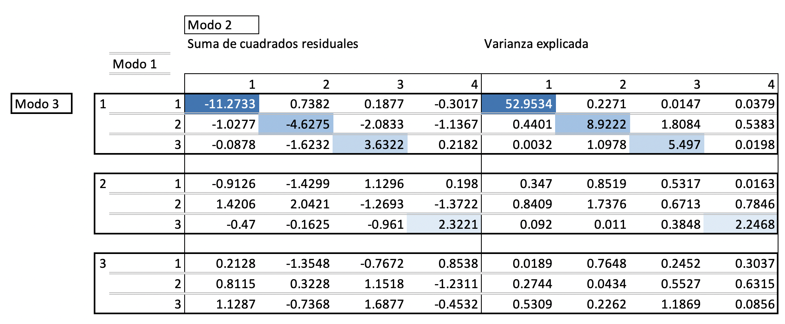

```{r setup, include=FALSE}
knitr::opts_chunk$set(echo = TRUE)
```

## Introducción

Este es un manual sobre cómo realizar un flujo de trabajo con el paquete `KTensorGraph` desarrollado por @Rodriguez2019 para utilizar la técnicas Tucker. En manual se centrarán en el Tucker-3, dado que con esta técnica se pueden detectar interacciones para la que se hayan retenido diferentes números de componentes para tres dimensiones. Asimismo, el flujo es reproducible ante cualquier otra técnica. Se recomienda revisar el trabajo de @rodriguez2018 para encontrar cálculos similares como referencia. 

Los datos utilizados provienen de la investigación de @thioulouse2004, en el cual los investigadores utilizaron el método STATICO para analizar una serie de tablas ecológicas pareadas de un área geográfica de Francia, cuyos nombres se describen en el cuadro \ref{descripcion}. El par se compone de abundancia de especies del lugar [^especies] y variables ambientales. Las filas corresponden a los sitios muestrados, los cuales son los mismos en ambas tablas. Además, las tablas se repiten por cada estación del año. 

[^especies]: Cabe aclarar que algunas especies pueden estar ausentes en algunas tablas.


```{r, eval=FALSE, echo=FALSE}
defin = data.frame(
    esp = c("Eda", "Bsp", "Brh", "Bni", "Bpu", "Cen", "Ecd", "Rhi", "Hla", "Hab", "Par", "Cae", "Eig"),
    Des = c(
      "Ephemera danica",
      "Baetis sp.",
      "Baetis rhodani",
      "Baetis niger",
      "Baetis pumilus",
      "Centroptilum",
      "Ecdyonurus",
      "Rhithrogena",
      "Habrophlebia lauta",
      "Habroletoides modesta",
      "Paraletophlebia",
      "Caenis",
      "Ephemerella ignita"
      ),
    var = c("Temp.", "Flow", "pH", "Conduct.", "Oxygen", "BDO5", "Oxydab.", "Ammo.", "Nitrates", "Phosps.", "", "", ""),
    Des = c(
      "Temperatura",
      "Flujo",
      "Concentración de iones de hidrógeno",
      "Conductividad",
      "Oxígeno",
      "Demanda biológica por oxígeno",
      "Oxidabilidad",
      "Amonio",
      "Nitratos",
      "Fosfato",
      "", "", ""
      )
    )
 
knitr::kable(defin, format = "latex", col.names = c("Especies", "Descripción", "Variables", "Descripción"))
```

-----------------------------------------------------------------------------
Especies   Descripción             Variables   Descripción                   
---------  ----------------------  ----------  ------------------------------
Eda        Ephemera danica         Temp.       Temperatura                   

Bsp        Baetis sp.              Flow        Flujo                         

Brh        Baetis rhodani          pH                                        

Bni        Baetis niger            Conduct.    Conductividad                 

Bpu        Baetis pumilus          Oxygen      Oxígeno                       

Cen        Centroptilum            BDO5        Demanda biológica por oxígeno 

Ecd        Ecdyonurus              Oxydab.     Oxidabilidad                  

Rhi        Rhithrogena             Ammo.       Amonio                        

Hla        Habrophlebia lauta      Nitrates    Nitratos                      

Hab        Habroletoides modesta   Phosps.     Fosfato                       

Par        Paraletophlebia                                                   

Cae        Caenis                                                            

Eig        Ephemerella ignita  

-----------------------------------------------------------------------------

: Descripción de especies y variables. \label{descripcion}


El objetivo principal del presente manual es brindar al lector las herramientas necesarias para poder diversas preguntas de investigación. Continuando con el ejemplo de las especies, los ejercicios responden las siguientes preguntas: 

* ¿En qué lugares las variables medioambientales cambian conforme las estaciones del año?
* ¿qué tendencias se pueden descubrir a lo largo de las estaciones?
* ¿hay diferentes tipos de lugares?

Esta no es una lista exhaustiva de todas las preguntas de investigación disponibles y es posible realizar investigaciones más profundas. Esto queda determinado por las inquietudes del investigador. 

## Preparación de entorno de trabajo

**NOTA**: este manual se realizó con la versión 3.6.3. Cabe señalar que aunque la versión 4.0.0 ya está disponible, se sugiere mantenerse en las versiones 3.3+ dado que diversos paquetes utilizados podrían sufrir problemas de compatibilidad.

### Instalación del paquete

Para instalar el paquete se escribe el código siguiente:

```{r, eval=FALSE}
install.packages("KTensorGraphs")
```

Notar que es necesario mantener las mayúsculas dado que R es sensible a mayúsculas y minúsculas.

Una vez instalado se carga con la función `library()`.

```{r, message=FALSE}
library(KTensorGraphs)
```


### Indicación de de directorio

Existen varias formas de indicarle al programa qué directorio utilizará. La más recomendada para cuestiones de reproducibilidad es crear un proyecto de R llamado `.Rproj`. Las instrucciones para cómo hacerlo se pueden consultar en la página de [RStudio](https://support.rstudio.com/hc/en-us/articles/200526207-Using-Projects). Con los proyectos ya no es necesario establecer en cada sesión el directorio y se pueden guardar opciones específicas para ese entorno en caso de ser necesario. Además, se puede compartir el archivo `.Rproj`, por lo que facilita reproducir el trabajo en cualquier ordenador.

Otra forma es utilizar la función `rstudioapi` como argumento de `setwd()` para establecer el directorio donde esté guardado el script:

```{r, eval=FALSE}
setwd(dirname(rstudioapi::getSourceEditorContext()$path))
# Descripción de funciones
# rstudioapi::getSourceEditorContext()$path # directorio del script
# dirname() # Extrae el directorio padre del archivo donde se trabajará todo
# setwd()   # Establece el directorio de trabajo
```

De esta manera no es necesario especificar explícitamente el directorio, manteniendo la ventaja de reproducibilidad sin necesidad de instalar un proyecto de R. No obstante, a diferencia de `.Rproj`, no se pueden establecer opciones específicos.

La otra vía es declarar explícitamente el directorio como argumento de `setwd()` similar al siguiente código:

```{r, eval=FALSE}
setwd("C:/Users/usuario/carpeta/personalizada")
```

Sin embargo, esta forma no se recomienda por limitar la reproducibilidad y ser propensa a errores.

## Preparación de datos

### Importación

Una vez establecido el entorno de trabajo, se pueden importar los datos. Para este manual se utilizará como ejemplo un cubo de datos ecológicos con lugares de río en filas, variables medioambientales en columnas y estaciones del año en capas en un archivo denominado `variables.txt`. En este caso, el archivo está separado por tabulador, por ello se utiliza la función `read.table()` para importar los datos en un objeto de clase  `data.frame`. Si los datos estuviesen separados por comas, se utilizaría `read.csv`. Por último, en caso de que se encuentren en una hoja de cálculo, e.g. `.xlsx`, se utilizaría la función `readxl::read_excel()`.

```{r}
variables <- read.table("variables.txt")
class(variables)
dim(variables) # Filas y columnas
```

Finalmente, los datos deben estar designados por `.` y no por `,` porque podría arrojar error. No obstante, las funciones `read.*` tienen un argumento llamado `dec` que recibirá el caracter que de corresponda a los decimales, pudiendo así leer archivos con decimales con coma. Aun así, el programa siempre convertirá cualquier numérico con decimales separados por puntos.

Al tratarse de un cubo, varias columnas se repiten de nombre por contener las estaciones del año. Como los nombres están repetidos de origen, R pone un sufijo `..N` para cada nombre repetido. De esta forma tenemos las columnas de `r paste(toString(colnames(var)[1:9]), colnames(var)[10], sep = " y ")` por cada estación:

```{r}
colnames(variables)
```

De la misma manera, importaremos el archivo `especies.txt`, que tiene el mismo formato de origen que `variables.txt`.

```{r}
especies <- read.table("especies.txt")
class(especies)
dim(especies)
colnames(especies)
```

### Indicación de de directorio

Existen varias formas de indicarle al programa qué directorio utilizará. La más recomendada para cuestiones de reproducibilidad es crear un proyecto de R llamado `.Rproj`. Las instrucciones para cómo hacerlo se pueden consultar en la página de [RStudio](https://support.rstudio.com/hc/en-us/articles/200526207-Using-Projects). Con los proyectos ya no es necesario establecer en cada sesión el directorio y se pueden guardar opciones específicas para ese entorno en caso de ser necesario. Además, se puede compartir el archivo `.Rproj`, por lo que facilita reproducir el trabajo en cualquier ordenador.

Otra forma es utilizar la función `rstudioapi` como argumento de `setwd()` para establecer el directorio donde esté guardado el script:

```{r, eval=FALSE}
setwd(dirname(rstudioapi::getSourceEditorContext()$path))
# Descripción de funciones
# rstudioapi::getSourceEditorContext()$path # directorio del script
# dirname() # Extrae el directorio padre del archivo donde se trabajará todo
# setwd()   # Establece el directorio de trabajo
```

De esta manera no es necesario especificar explícitamente el directorio, manteniendo la ventaja de reproducibilidad sin necesidad de instalar un proyecto de R. No obstante, a diferencia de `.Rproj`, no se pueden establecer opciones específicos.

La otra vía es declarar explícitamente el directorio como argumento de `setwd()` similar al siguiente código:

```{r, eval=FALSE}
setwd("C:/Users/usuario/carpeta/personalizada")
```

Sin embargo, esta forma no se recomienda por limitar la reproducibilidad y ser propensa a errores.

## Preparación de datos

### Importación

Una vez establecido el entorno de trabajo, se pueden importar los datos. Para este manual se utilizará como ejemplo un cubo de datos ecológicos con lugares de río en filas, variables medioambientales en columnas y estaciones del año en capas en un archivo denominado `variables.txt`. En este caso, el archivo está separado por tabulador, por ello se utiliza la función `read.table()` para importar los datos en un objeto de clase  `data.frame`. Si los datos estuviesen separados por comas, se utilizaría `read.csv`. Por último, en caso de que se encuentren en una hoja de cálculo, e.g. `.xlsx`, se utilizaría la función `readxl::read_excel()`.

```{r}
variables <- read.table("variables.txt")
class(variables)
dim(variables) # Filas y columnas
```

Finalmente, los datos deben estar designados por `.` y no por `,` porque podría arrojar error. No obstante, las funciones `read.*` tienen un argumento llamado `dec` que recibirá el caracter que de corresponda a los decimales, pudiendo así leer archivos con decimales con coma. Aun así, el programa siempre convertirá cualquier numérico con decimales separados por puntos.

Al tratarse de un cubo, varias columnas se repiten de nombre por contener las estaciones del año. Como los nombres están repetidos de origen, R pone un sufijo `..N` para cada nombre repetido. De esta forma tenemos las columnas de `r paste(toString(colnames(var)[1:9]), colnames(var)[10], sep = " y ")` por cada estación:

```{r}
colnames(variables)
```

De la misma manera, importaremos el archivo `especies.txt`, que tiene el mismo formato de origen que `variables.txt`.

```{r}
especies <- read.table("especies.txt")
class(especies)
dim(especies)
colnames(especies)
```

### Preprocesamiento

Para facilitar los resultados de las funciones de `KTensorGraphs` se pueden designar los nombres de cada una de las dimensiones del tensor con ayuda de la función `dimnames()`.

```{r}
nom_esp <- dimnames(especies)
nom_var <- dimnames(variables)
class(nom_var)
```

Esta función genera una `list` de la cual se pueden seleccionar los elementos mediante tres selectores: `[]`, `[[]]` y `$`.

* `[]` recibe como argumento un número entero que indicará el lugar del elemento de la lista. Su resultado será otra lista. Ejemplo: `class(lista[1])` será de clase `list`.
* `[[]]` también recibe un entero, pero devuelve la clase del elemento que contiene. Es decir, si el elemento `lista[[1]]` es de clase `logical`, tendremos un resultado booleano.
* `$` funciona al igual que una `data.frame` en el sentido de que también arroja la clase del elemento seleccionado. Sin embargo, para que esto funcione la lista debe contener un nombre, de lo contrario no arrojará ningún resultado.

```{r}
names(nom_var) <- names(nom_esp) <- c("filas", "columnas")
nom_var
```

En nuestro ejemplo se definen nombres en cuatro objetos: el de las filas `nom_filas`, el de las columnas `nom_col_x` y `nom_col_y` y el de las repeticiones `nom_repet`:

```{r}
nom_filas <- nom_esp$filas
nom_col_x <- nom_esp$columnas[1:13]
nom_col_y <- nom_var$columnas[1:10]

# Como no existen previamente los nombres de las estaciones,
# los establecemos manualmente
nom_repet <- c("Primavera", "Verano", "Otoño", "Invierno")
```

También utilizaremos el número de cada dimensión de la siguiente manera: [^num-estaciones]

```{r}
n_repet <- length(nom_repet)
n_filas <- nrow(especies)
n_col_x <- ncol(especies)  / n_repet
n_col_y <- ncol(variables) / n_repet
```

Una vez que se definen los nombres, creamos el tensor. Sabemos que `especies` y `variables` son de clase `data.frame`. Esto significa que son datos de dos dimensiones. Para hacerlos de tres dimensiones se transforman a la clase `array` con su función homónima, de la cual definiremos los siguientes argumentos `x`, `dim` y `dimnames`:

* En `data` pondremos el `data.frame`. Para hacerlo de forma correcta se puede utilizar la función `unlist()` o convertirlo a `matrix` con la función `as.matrix()` para explícitamente cambie `data.frame -> matrix -> array`. [^matrix-array]
* En `dim` se coloca un vector cuyo número de elementos indicarán el número de dimensiones. Cada valor de los elementos establecerá el tamaño de cada dimensión.
* En `dimnames` se indica una lista con los nombres de cada dimensión.

[^matrix-array]: En la versión 4.0.0 la clase `matrix` ya contiene también la clase `array`.
[^num-estaciones]: En el contexto del ejercicio `dimnames` basta con poner `c(6, 10, 4)`. No obstante, se considera como buena práctica extraer el número de los elementos con las funciones `dim()`, `nrow()`, `ncol()` o `length()`. Esto con el fin de evitar errores del programa en caso de que el tamaño de los datos cambien.

Siguiendo con nuestro ejemplo, el código queda de la siguiente manera:

```{r}
esp_cubo <- array(
  data = as.matrix(especies),
  dim = c(n_filas, n_col_x, n_repet),
  dimnames = list(nom_filas, nom_col_x, nom_repet)
)
# Se redondean los números para impresión sin cambiar el tensor
round(esp_cubo, 2) 
```


```{r}
var_cubo <- array(
  data = as.matrix(variables),
  dim = c(n_filas, n_col_y, n_repet),
  dimnames = list(nom_filas, nom_col_y, nom_repet)
)
round(var_cubo, 2)
```

Finalmente, se definen colores de las filas y las columnas que servirán para diferenciar los datos en los gráficos producidos.

```{r}
col_filas <- rep("#428bca", times = n_filas)
col_col_x <- rep("#d9534f", times = n_col_x)
col_col_y <- rep("#5cb85c", times = n_col_y)
```

Terminados estos pasos, podemos proceder a analizar los paquetes.

## Función

Para estudiar las posibles relaciones entre lugares y los cambios en las variables medioambientales durante las cuatro estaciones del año mediante un Tucker3 se utiliza la función `KTensorGraph::TUCKER3()`. 

El primer paso es calcular un **screeplot** para saber de él cuál es el modelo más simple y más estable. Para ello, hay que considerar los argumentos de la función `TUCKER3()` mostrados en el cuadro \ref{arg_screeplot}: 

-----------------------------------------------------------------
Argumento  Descripción
---------- ------------------------------------------------------
`X`        Indica el `array` de 3 dimensiones con el que operará.

`p`, `q`,  El número de componentes de cada dimensión que será retenido.
`r`        Por defecto, la función computa todas las combinaciones posibles.
           
`norm`     Recibe como valor un `logical` para indicar si se debe
           normalizar por capas laterales. Por defecto es `FALSE`.

`contr`    Recibe un `logical` para indicar si se deben obtener las 
           tablas de las contribuciones para la primera, segunda y
           tercera dimensión. Por defecto es `FALSE`.

`maximo`   Recibe un `integer` para establecer el número de componentes
           retenidos por cada dimensión, i.e. `p = q = r = 5`. Esto sirve
           como medida de seguridad para evitar consumo de memoria
           innecesario. Por defecto se establecen `5` componentes.

`iter`     Recibe un `integer` que indica el número máximo de iteraciones
           computado para cada combinación de componentes. Generalmente 
           se busca aumentar el número de iteraciones para igualar la
           matriz original. Esto puede provocar un bucle infinito, por 
           lo que este argumento previene que esto suceda. Por defecto
           están definidas `100` iteraciones.

`tol`      Recibe un `numeric` para establecer un umbral mínimo de
           tolerancia. La tolerancia es la diferencia entre dos matrices
           similares. Si se tuviese una tolerancia baja, probablemente 
           se necesiten más iteraciones. Si la tolerancia es alta, se 
           puede reducir el número de iteraciones. Por defecto la
           tolerancia es de `1e-8`.
           
`P1`,      Representaciones de los ejes horizontal (`*1`) y  
`P2`       vertical (`*2`) de la primear dimensión. Reciben un 
           `integer >= 1` o `<=` el número de elementos que 
           integran la primera dimensión, además deben cumplir 
           `P1 < P2` (a menos que se retenga un solo componente).
           
`Q1`, `Q2`  Aplica de manera análoga a los argumentos `P*`.
,`R1`, 
`R2`
           
-----------------------------------------------------------------

: Argumentos de `TUCKER3()` para hacer un screeplot. \label{arg_screeplot}

Luego entonces, si queremos normalizar las variables y utilizar el resto de argumentos por defecto resulta razonable, el código queda de la siguiente manera:


```{r, eval=FALSE}
TUCKER3(X = var_cubo, norm = TRUE)
```

```{r screeplot, echo=FALSE, out.width = "100%", fig.cap = "Screeplot de variables medio ambientales"}
knitr::include_graphics("var_screeplot.pdf")
```

La figura \@ref(fig:screeplot) muestra los modelos por cada dimensión. Los puntos están nombrados por cuántos componentes fueron retenidos. La línea azul indica los modelos con mejor ajuste para cada complejidad; el mejor ajuste estará más cercano a la línea poligonal. La línea rosa la estabilidad separa a los modelos más estables en la parte derecha de los inestables en la parte izquierda. Por lo tanto, el mejor modelo será el más estable, con mejor ajuste y menos complejo, que en el caso de las variables es el modelo $3 \times 3 \times 2$.

Una vez elegidas la combinación de componentes, se obtienen la tabla con las contribuciones y el core array. Para realizar lo anterior se define el argumento `contr = TRUE`.

```{r, eval=FALSE}
TUCKER3(var_cubo, norm = TRUE, contr = TRUE)
```

La función genera un archivo denominado `results.txt` en el que coloca los resultados.

Table: Todas las combinaciones \label{combinaciones}

 Number  Model Size      Sum  Best given Sum       SS(Res)   Prop. SS(Fit)   Number of iterations
-------  -----------  ------  --------------- ------------  --------------  ---------------------
      1  1x1x1           3    *                  27.700593        53.83288                      6
      6  1x2x2           5                       25.200309        57.99997                     12
     11  1x3x3           7                      24.033849        59.94405                      9
     16  1x4x4           9                       23.732024        60.44709                      7
     22  2x1x2           5                      25.620344        57.29992                      6
     25  2x2x1           5    *                 20.842849        65.26232                     18
     26  2x2x2           6    *                 18.837457        68.60460                     16
     27  2x2x3           7                      18.280058        69.53359                     15
     28  2x2x4           8                      18.170730        69.71580                     14
     30  2x3x2           7                      16.838369        71.93638                     12
     31  2x3x3           8                      15.458909        74.23545                     21
     32  2x3x4           9                      14.882902        75.19545                     15
     34  2x4x2           8                      15.856260        73.57321                     10
     35  2x4x3           9                      14.197101        76.33844                     14
     36  2x4x4          10                      13.317782        77.80396                     17
     39  2x5x3          10                      13.487035        77.52187                     21
     40  2x5x4          11                      12.138948        79.76866                     12
     43  3x1x3           7                      25.195784        58.00752                      6
     46  3x2x2           7                      18.103313        69.82816                     16
     47  3x2x3           8                      16.899248        71.83491                     14
     48  3x2x4           9                      16.706654        72.15590                     17
     49  3x3x1           7    *                 16.759840        72.06726                      6
     50  3x3x2           8    *                 13.870925        76.88206                     22
     51  3x3x3           9    *                 11.685176        80.52493                     17
     52  3x3x4          10                      10.846185        81.92324                      6
     54  3x4x2           9                      11.744310        80.42638                     12
 __55__  __3x4x3__    __10__  *               __9.036134__    __84.93995__                    __11__
     56  3x4x4          11                       7.647544        87.25424                      4
     58  3x5x2          10                      11.012009        81.64686                     10
     59  3x5x3          11    *                  7.154399        88.07614                      9
     60  3x5x4          12    *                  5.427397        90.95444                      5
     64  4x1x4           9                      25.166315        58.05663                     10
     66  4x2x2           8                      18.047997        69.92036                     13
     67  4x2x3           9                      16.568926        72.38545                     10
     68  4x2x4          10                      15.973017        73.37861                      6
     70  4x3x2           9                      13.160961        78.06532                     10
     71  4x3x3          10                      10.668085        82.22006                     26
     72  4x3x4          11                       9.026174        84.95655                      4
     73  4x4x1           9                      16.107873        73.15386                     14
     74  4x4x2          10                      10.944688        81.75907                     10
     75  4x4x3          11                       8.009536        86.65093                     11
     76  4x4x4          12                       5.626640        90.62238                      4
     78  4x5x2          11                      10.151488        83.08105                     23
     79  4x5x3          12                       5.834490        90.27596                      9
     80  4x5x4          13    *                  3.040837        94.93200                      4
     87  5x2x3          10                      16.521806        72.46398                      8
     88  5x2x4          11                      15.893292        73.51149                      3
     90  5x3x2          10                      13.139658        78.10083                     10
     91  5x3x3          11                      10.643393        82.26122                     56
     92  5x3x4          12                       8.838853        85.26875                      2
     94  5x4x2          11                      10.775779        82.04058                     10
     95  5x4x3          12                       7.733202        87.11148                     11
     96  5x4x4          13                       5.209215        91.31808                      2
     97  5x5x1          11                      15.790924        73.68210                     17
     98  5x5x2          12                       9.954225        83.40982                     18
     99  5x5x3          13                       5.478001        90.87010                      9
    100  5x5x4          14    *                  2.509695        95.81722                      2


Table: Combinaciones con mejor ajuste \label{mej-ajuste}

 Number  Model Size         S       SS(Res)          DifFit   Prop. SS(Fit)   Number of iterations
-------  -----------  -------  -------------  -------------  --------------  ---------------------
      1  1x1x1              3      27.700593      53.832883        53.83288                      6
     25  2x2x1              5      20.842849      11.429440        65.26232                     18
     26  2x2x2              6      18.837457       3.342280        68.60460                     16
     49  3x3x1              7      16.759840       3.462655        72.06726                      6
     50  3x3x2              8      13.870925       4.814802        76.88206                     22
     51  3x3x3              9      11.685176       3.642873        80.52493                     17
 __55__  __3x4x3__      __10__  __9.036134__   __4.415018__    __84.93995__                 __11__
     59  3x5x3             11       7.154399       3.136188        88.07614                      9
     60  3x5x4             12       5.427397       2.878305        90.95444                      5
     80  4x5x4             13       3.040837       3.977552        94.93200                      4
    100  5x5x4             14       2.509695       0.885227        95.81722                      2

Entonces, conforme a los cuadros \ref{combinaciones} y \ref{mej-ajuste}  en el modelo elegido $3 \times 4 \times 3$, se tiene una suma de 10 (`Sum` o `S`), está indicado como uno de los mejores modelos dada la suma (`Best given Sum`), con una suma de cuadrados desigual de $9.04$ (`SS(Res)`), cuya proporción de varianza explicada con respecto al cubo original es de $84.93\%$ (`Prop. SS(Fit)`) que aumentó $4.42$ con respecto al modelo anterior (`DiffFit`) y con 11 iteraciones realizadas.

### Descomposición Tucker3

Una vez que se ha definido el modelo $3 \times 4 \times 3$, en la función `TUCKER3()` se pueden utilizar los parámetros `p`, `q`, y `r` respectivamente. A su vez, se definen los colores con los argumentos `colores*`.

```{r, eval=FALSE}
TUCKER3(X = var_cubo, norm = TRUE, contr = TRUE, p = 3, q = 4, r = 3, 
        coloresf = col_filas, coloresc = col_col_y)
```


```{r encdeb, echo=FALSE, fig.cap="Elementos de la contribución media"}
knitr::include_graphics("encima_debajo_var.pdf")
```

En primer lugar, da como resultado el gráfico \@ref(fig:encdeb) que indica los elementos por encima y por debajo de la contribución media. En el cuadro de la izquierda señala que los lugares `S1`, `S3`, `S4` y `S5` se encuentran por encima de la media. Análogamente, al cuadro de en medio corresponden a `Oxygen`, `Temp` y `pH`. Finalmente, en el cuadro de la derecha, las estaciones de verano y otoño tienen una contribución menor.

Asimismo, se crea una nueva tabla de resultados `results.txt` con el *core array* (el más importante), las contribuciones y los porcentajes de ajuste.

```{r corearray, echo=FALSE, out.width="95%", fig.cap="Configuración del core array."}

```

Como lo muestra el esquema \@ref(fig:corearray) En el caso del *core array*, la tabla está dividida en dos partes: en un lado se muestra la suma de cuadrados residual (los elementos del `core array`) y en otra la varianza explicada (su desglose para cada una de las combinaciones). Además, los modos indican las dimensiones a las que se refieren. Modo 1 corresponde a `p`, Modo 2 a `q` y Modo 3 a `r`.


Table: Porcentajes de ajuste \label{ajuste}

Componentes                    Dimensión 1   Dimensión 2   Dimensión 3
----------------------------  ------------  ------------  ------------
1                                   56.313       55.5010       71.5599
2                                   17.245       13.8817        8.5158
3                                   11.382       10.8926        4.8642
4                                    0.000        4.6646        0.0000
Total de varianza explicada         84.940       84.9400       84.9400


Adicionalmente, el cuadro \ref{ajuste} muestra el porcentaje del ajuste de varianza total y de cada componente del modelo.

El archivo `results.txt` también contiene as coordenadas de las filas, de las columnas y de las repeticiones, así como sus contribuciones correspondientes, se obtienen para biplots posteriores. Se pueden consultar directamente en el archivo.

### Interacciones

Finalmente, para poder interpretar las diferentes interacciones más profundas entre lugares, variables medioambientales y estaciones del año, se extraen 4 elementos del *core array*. Se cuenta con la ayuda de gráficos bidimensionales. En el cuadro \ref{arg_screeplot} se describen los argumentos de la función `TUCKER3()` para obtener dicho `array`.

El criterio para elegir las combinaciones de signos adecuados es considerar los elementos que tengan la varianza explicada más alta, con los elementos de valores residuales con signo positivo. Cabe señalar que en los modelos **Tucker**, los signos del *core array* en conjunto con los de las contribuciones determina la dirección de interacción entre las dimensiones.

Luego entonces, conforme a lo señalado en el esquema , el elemento con la varianza explicada más alta  es $52.95\%$ y corresponde a los modos 1, 1, 1 y el signo de la varianza core es negativo (porque la suma de residuos es $-11.27$) . El segundo elemento de los modos 2, 2, 1 es $8.92\%$, también con signo negativo. Le sigue el elemento con modos 3, 3, 1 con $5.49\%$ de varianza explicada y signo positivo. Finalmente, el cuarto elemento se encuentra en los modos 3,4,2 con $2.25\%$ de varianza explicada y signo positivo. 

Se prosigue a interpretar las primeras dos configuraciones de los elementos. Notar que en el nuevo código no es necesario pedir las contribuciones:

```{r, eval=FALSE}
TUCKER3(X = var_cubo, norm = TRUE, p = 3, q = 4, r = 3,
        P1 = 1, P2 = 2, Q1 = 1, Q2 = 2, R1 = 1, R2 = 2,
        coloresf = col_filas, oloresc = col_col_y)
```

```{r elem12, echo=FALSE, fig.cap="Biplots de contribuciones 1 y 2"}
knitr::include_graphics("interaccion_var_1_2.pdf")
```

```{r elem12may, echo=FALSE, fig.cap="Elementos de 1 y 2 con mayor contribución"}
knitr::include_graphics("interaccion_var_1_2_mayor.pdf")
```

La figura \@ref(fig:elem12) muestran tres cuadros: de izquierda a derecha señala los lugares, las variables medioambientales y las estaciones del año. En todos está el componente 1 en el eje horizontal y el componente dos en el de las ordenadas. Del mismo modo, la figura \@ref(fig:elem12may) solamente muestra los elementos con mayor contribución en cada componente. Por ejemplo: en los sitios `S4` y `S5` están positivamente relacionados con el `pH` y el `Oxygen` y negativamente en todas las épocas del año. Pero como el signo del *core array* es negativo, quedará en total una relación positiva.

Esta interpretación se repite para cada uno de los elementos que se deseen. Esto implica que el método para interpretar  las figuras \@ref(fig:elem34) y \@ref(fig:elem34may) será el mismo que para las figuras anteriores.

```{r}
TUCKER3(X = var_cubo, norm = TRUE, p = 3, q = 4, r = 3,
        P1 = 2, P2 = 3, Q1 = 3, Q2 = 4, R1 = 1, R2 = 2,
        coloresf = col_filas, coloresc = col_col_y)
```

```{r elem34, out.width="100%", fig.cap="Biplots de contribucionesc 3 y 4"}
knitr::include_graphics("interaccion_var_3_4.pdf")
```

```{r elem34may, out.width="100%", fig.cap="Elementos de 3 y 4 con mayor contribución"}
knitr::include_graphics("interaccion_var_3_4_mayor.pdf")
```


## Conclusiones 

Con este manual se intentó mostrar cómo aplicar el modelo Tucker-3 para datos de tres dimensiones. Esta técnica permite fácilmente desglosar las interacciones entre variables que de otra forma solo se podrían obtener agregadamente. Existe mucha investigación por realizar con estas técnicas, con especial atención a datos espaciales.

# Bibliografía